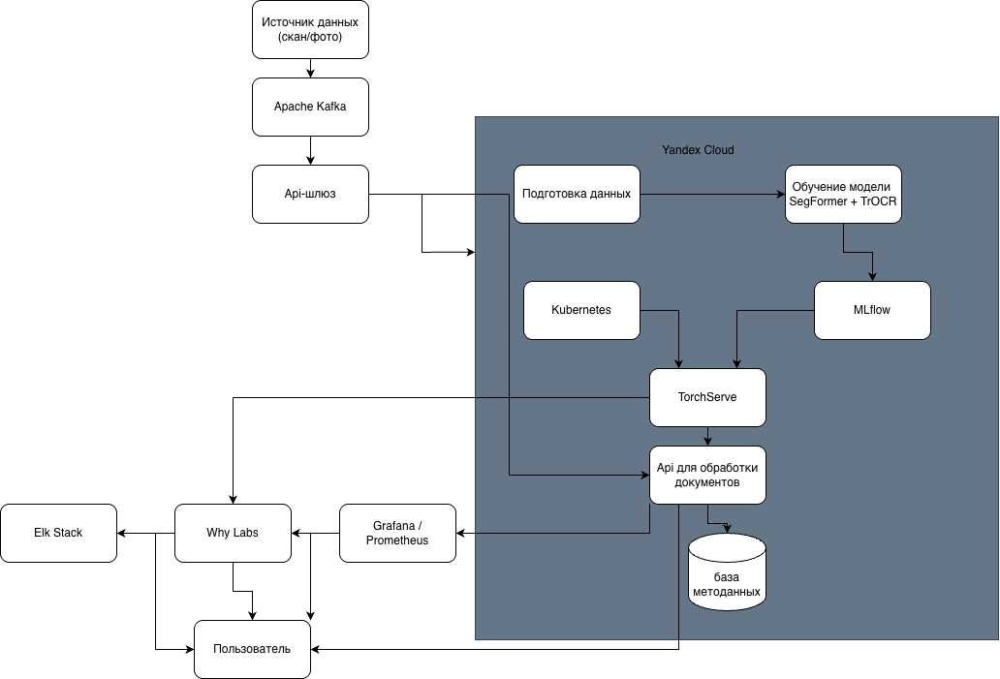
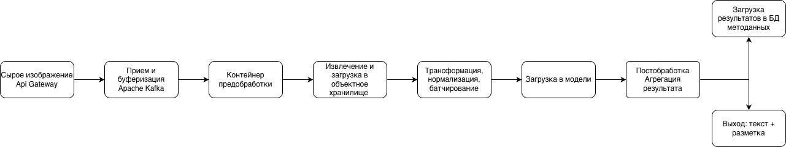
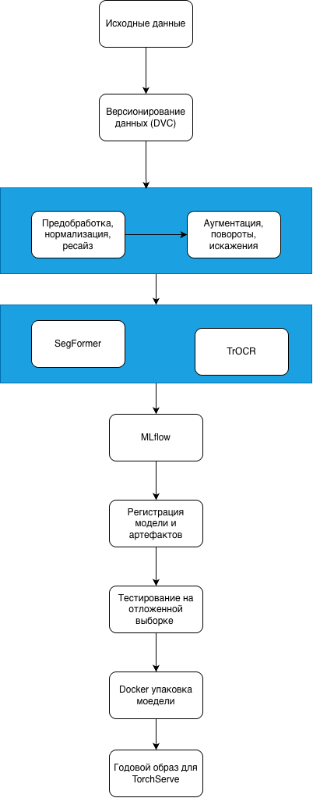
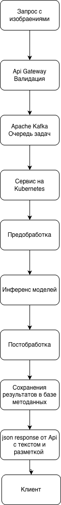

**Курс:** проектирование систем машинного обучения

**Уровень:** 2 курс магистратуры

**Задание 4**

## 1. Введение и постановка задач

Проектируется система для автоматической обработки и анализа отсканированных исторических документов. Система должна извлекать из изображений текстовое содержимое с высокой точностью, а также распознавать и сегментировать структурные элементы макета, такие как таблицы, иллюстрации и текстовые блоки.

**Бизнес цели**

- Повышение эффективности обработки: сократить время на оцифровку и каталогизацию исторического документального фонда на 80% за счет автоматизации извлечения текста и структуры.
- Оптимизация затрат: снизить расходы на ручную расшифровку текста и разметку макетов документов на 70% путем внедрения автоматизированного OCR и анализа макета.
- Улучшение точности данных: достичь точности распознавания текста (CER) не менее 99.5% для печатных документов и обеспечить корректную сегментацию таблиц и рисунков с точностью (F1-score) выше 95%.

**Требования к системе**

- Задержка (latency) ответа не должна превышать **161 мс**.
- Система должна обслуживать **2,791,028 активных пользователей в день (DAU)**, с пиковой нагрузкой в **4,353 запросов в секунду (RPS)**.
- Система должна быть масштабируемой и отказоустойчивой.

## Часть 1: Формулировка ML-задачи и выбор модели

**Определение ML-задачи**

- **Формулировка задачи:**  сочетание семантической сегментации макета документов и OCR;
- **Входные данные:** отсканированные изображения в высоком разрешении;
- **Выходные данные:** Размеченное изображение, в котором каждому пикселю присвоен класс - **таблица, иллюстрация или текстовый блок** / для каждого текстового блока распознанная с высокой точностью строка;
- **Целевые переменные:** получение маски, в качестве метрики предлагается использовать **f1-score** / текстовая строка, метрика - **CER (Character Error Rate)**.

**Выбор модели**

- SegFormer + TrOCR:

        Плюсы: модель SegFormer характерезует высокая скорость и точность для сегментации макета. Позволяет достигнуть высоких значений f1-score (0.9+). Быстрее многих аналогов, что важно для соблюдения задержки в 161 мс. Модель TrOCR также показывает показатель CER ниже 2%.
        Минусы: высокое требование к вычислительным ресурсам и энергии. Острая зависимость от качества и объема данных, используемых для обучения. Сложная эксплуатация. 

- OpenCV + Tesseract

        Плюсы: простота развертывания и минимальные зависимости, предсказуемость и      контроль на простых данных.
        Минусы: низкая робастность, невозможность достижения целевых показателей точности, отсутствие масштабируемости и высокая операционная стоимость.

Для поставленной задачи выбираем SegFormer + TrOCR, потому что этот стек на основе трансформеров напрямую нацелен на достижение целевых метрик. SegFormer обеспечивает точную сегментацию сложного исторического макета, что критично для F1-score > 95%. Его выход — чистые текстовые маски — служит идеальным входом для TrOCR, который как state-of-the-art модель способен достигать CER 1-2% и приблизиться к требуемым 99.5% точности.

## Часть 2: Проектирование архитектуры 

**Высокоуровневая архитектура.**

- Источник данных (сканеры/камеры): Устройства, с которых поступают отсканированные изображения исторических документов.

- Apache Kafka: Распределённая потоковая платформа, которая служит высокопроизводительной и отказоустойчивой «нервной системой» для асинхронной передачи событий и данных между компонентами. 

- API-шлюз (API Gateway): Единая точка входа в систему, принимающая запросы, проверяющая корректность загружаемых изображений и распределяющая нагрузку.

- Yandex Cloud: Облачная платформа, на которой развёрнута вся инфраструктура. Включает объектное хранилище для исходных изображений, промежуточных артефактов и результатов обработки.

- База метаданных: Хранит информацию о документах: их статус, ссылки на файлы в хранилище, распознанный текст и разметку структурных элементов (таблиц, заголовков, текстовых блоков).

- Подготовка данных: Этап, на котором данные очищаются, аугментируются и подготавливаются для обучения моделей.

- Обучение модели (SegFormer + TrOCR): Процесс обучения и валидации двух ключевых моделей: модели сегментации макета документа (SegFormer) и модели оптического распознавания текста (TrOCR).

- MLflow: Система управления жизненным циклом машинного обучения. Используется для хранения версий обученных моделей, их метаданных и метрик качества.

- TorchServe: Сервис для эффективного обслуживания (serving) моделей PyTorch. Здесь развёрнуты и работают production-модели.

- API для предсказаний: Интерфейс, который получает запросы от API-шлюза, взаимодействует с TorchServe для выполнения предсказаний и возвращает результаты.

- Kubernetes: Оркестратор контейнеров, который управляет развёртыванием, масштабированием и отказоустойчивостью всех микросервисов (включая TorchServe и API для предсказаний).

- Grafana / Prometheus: Стек для системного мониторинга. Prometheus собирает метрики (задержки, нагрузку), а Grafana визуализирует их в виде дашбордов.

- Мониторинг данных / WhyLabs: Специализированный инструмент для мониторинга данных и моделей (Data & Model Drift). Выявляет аномалии и дрейф распределения данных, сигнализируя о необходимости обновления моделей.

- Elk Stack (ELK): Стек для сбора, хранения и анализа логов (Elasticsearch, Logstash, Kibana). Обеспечивает централизованное логирование работы всех компонентов.

- Пользователь: Конечный потребитель системы, который загружает документы и получает результаты распознавания.

**Архитектура Data Pipeline.**

- Источники данных: Сканеры и камеры загружают изображения документов в систему через API-шлюз.

- Прием и буферизация: API-шлюз валидирует данные и отправляет события о новых изображениях в Apache Kafka для асинхронной обработки.

- Хранение: Изображения сохраняются в объектное хранилище Yandex Cloud, а их метаданные — в специализированную базу данных.

- Предобработка (обслуживание): Сервис на Kubernetes извлекает изображение, применяет необходимые преобразования (например, изменение размера, нормализацию) и подготавливает батч для модели.

- ML Inference: Обработанный батч отправляется через TorchServe в модель SegFormer для сегментации макета, а затем извлеченные текстовые области передаются в модель TrOCR для распознавания текста.

- Постобработка и сохранение: Результаты (маска сегментации и распознанный текст) агрегируются, связываются с исходным документом и сохраняются в базу метаданных и объектное хранилище.

- Мониторинг: Prometheus и WhyLabs собирают метрики производительности и данные для выявления дрейфа, а ELK-стек агрегирует логи для отладки.

**Архитектура Training Pipeline.**

- Сбор и версионирование: Исторические изображения и их разметка (маски сегментации, тексты) автоматически собираются из объектного хранилища и системы разметки, версионируются с помощью DVC (Data Version Control) для обеспечения воспроизводимости.

- Подготовка и аугментация: Данные проходят конвейер предобработки (нормализация, изменение размера) и аугментации (повороты, искажения) в PyTorch DataLoader для увеличения разнообразия обучающей выборки и улучшения обобщающей способности моделей.

- Обучение и валидация: Модели SegFormer (для сегментации) и TrOCR (для OCR) обучаются параллельно или последовательно на GPU-кластере, с валидацией после каждой эпохи для контроля метрик (F1-score и CER) и предотвращения переобучения.

- Логирование и регистрация: Все эксперименты, метрики, гиперпараметры и артефакты (чекпоинты моделей) фиксируются в MLflow, что позволяет сравнивать подходы и выбирать лучшую модель для развертывания.

- Тестирование и упаковка: Лучшая модель проходит финальное тестирование на отложенной тестовой выборке, после чего упаковывается в Docker-образ со всеми зависимостями для последующего развертывания через TorchServe.

**Архитектура Inference Pipeline (Serving).**

- Прием и очередь: API-шлюз принимает запросы с изображениями, проводит базовую валидацию и помещает их в распределенную очередь Apache Kafka для асинхронной буферизации и обеспечения отказоустойчивости.

- Предобработка и инференс: Сервис-воркер забирает задачи из Kafka, загружает изображение, применяет необходимые трансформации (ресайз, нормализацию) и отправляет батч в сервис TorchServe, где последовательно выполняются модели SegFormer (сегментация) и TrOCR (распознавание текста).

- Постобработка и ответ: Результаты моделей (маска классов и распознанный текст) агрегируются, текст структурируется, а финальный ответ (JSON с текстом и разметкой) сохраняется в базу метаданных и возвращается клиенту через API.

## Часть 3: Расчёты и нефункциональные требования (Мини-отчёт)

**Расчёт требований к хранилищу.**

**Объем одного изображения:**

- Разрешение: 3000x4000 пикселей (типично для сканов документов)

- Каналы: 3 (RGB)

- Без сжатия: 3000 × 4000 × 3 = 36 МБ

- Со сжатием (PNG, 0.5): = 18 МБ

**Поток данных в секунду (пиковый):**

- 4,353 изображения/сек × 18 МБ = 78.4 ГБ/с

**Объем данных в день:**

- 2.79M пользователей × 10 изображений × 18 МБ = 502 ТБ/день

**Требуемое хранилище:**

- Сырые изображения (30 дней): 502 ТБ/день × 30 = 15 ПБ

- Размеченные данные (архив): примерно 2 ПБ

- Результаты инференса (маски + текст): примерно 3 ПБ

- Модели и артефакты ML: примерно 5 ТБ

- База метаданных: примерно 10 ТБ

**Итого:** ≈20 ПБ (без учёта репликации и логов)

**Расчёт требований к пропускной способности**

- Требуемая пропускная способность (пиковая): 4353 RPS.

Производительность одной ноды (оценка):

- Инференс пайплайна (SegFormer -> TrOCR) на GPU A100 (для соблюдения latency 161 мс).

- Одна нода A100 обрабатывает примерно 120 RPS для полного пайплайна при среднем размере изображения 18 МБ.

Количество нод (расчётное):

- Базовое: 4353 RPS ÷ 120 RPS/нода = 37 нод

- С учётом отказоустойчивости (+20%): 45 нод

Требования к сети (пиковые):

- Входящий трафик (запросы): 4353 RPS × 18 МБ = 78354 МБ/с ≈ 76.5 ГБ/с

- Внутренний трафик (модели, кеш): примерно 5% от входящего = 3.8 ГБ/с

- Исходящий трафик (результаты): 4353 RPS × 0.05 МБ (JSON + маска) = 217 МБ/с

Пропускная способность на ноду:

- Входящая: 76.5 ГБ/с ÷ 45 нод = 1.7 ГБ/с на ноду

- Исходящая: 217 МБ/с ÷ 45 нод = 4.8 МБ/с на ноду

Итог:

- Ключевая трудность — входящий трафик (76.5 ГБ/с). Требуется распределённая загрузка через CDN/многорегиональные шлюзы.

- Необходима высокоскоростная сеть (25-100 Гбит/с) внутри кластера и от шлюза к хранилищу.

**Масштабируемость и надёжность.**

Масштабируемость:

- Горизонтальное автомасштабирование: При увеличении нагрузки Kubernetes автоматически добавляет реплики сервиса инференса на основе метрик CPU и RPS, обеспечивая обработку пиковой нагрузки в 4.3 тыс. запросов в секунду.

- Масштабирование инфраструктуры данных: Платформа Apache Kafka и объектное хранилище масштабируются горизонтально за счет добавления узлов для обработки высокого трафика и больших объемов данных.

- Масштабирование вычислительного кластера: Группы GPU-инстансов в облачной платформе динамически расширяются для параллельного обучения и тонкой настройки моделей по мере роста обучающих данных.

Надёжность:

- Избыточность и распределение: Критические компоненты развернуты с несколькими репликами в различных зонах доступности для обеспечения отказоустойчивости.

- Контроль работоспособности: Для всех сервисов и моделей настроены проверки жизнеспособности (liveness) и готовности (readiness), обеспечивающие автоматическое исключение неисправных экземпляров.

- Резервное копирование: Регулярно создаются резервные копии базы метаданных, а версии моделей сохраняются в системе управления ML-жизненным циклом.

- Мониторинг и оповещение: Система мониторинга отслеживает ключевые метрики производительности и данные, отправляя уведомления при отклонениях от заданных порогов.

- Автоматическое восстановление: Оркестратор Kubernetes обеспечивает перезапуск сервисов при сбоях, а потоковая платформа гарантирует доставку и повторную обработку сообщений.

## Список источников

1. Apache Kafka Documentation : официальная документация : [веб-сайт]. – URL: https://kafka.apache.org/documentation/ (дата обращения: 27.12.2024). – Текст: электронный.

2. Elastic. What is the ELK Stack? : [веб-сайт]. – URL: https://www.elastic.co/what-is/elk-stack (дата обращения: 27.12.2024). – Текст: электронный.

3. Grafana Labs : [веб-сайт]. – URL: https://grafana.com/ (дата обращения: 27.12.2024). – Текст: электронный.

4. Li, M. TrOCR: Transformer-based Optical Character Recognition with Pre-trained Models / M. Li, T. Lv, L. Cui, Y. Lu, D. A. F. Florêncio, C. Zhang, Z. Li, F. Wei // arXiv.org : электронный препринт. – 2021. – arXiv:2109.10282. – URL: https://arxiv.org/pdf/2109.10282.pdf (дата обращения: 27.12.2024). – Текст: электронный.

5. NVIDIA Corporation. NVIDIA A100 Tensor Core GPU Architecture : техническая документация. – 2020. – URL: https://images.nvidia.com/aem-dam/en-zz/Solutions/data-center/nvidia-ampere-architecture-whitepaper.pdf (дата обращения: 27.12.2024). – Текст: электронный.

6. Prometheus : система мониторинга : [веб-сайт]. – URL: https://prometheus.io/ (дата обращения: 27.12.2024). – Текст: электронный.

7. Xie, E. SegFormer: Simple and Efficient Design for Semantic Segmentation with Transformers / E. Xie, W. Wang, Z. Yu, A. Anandkumar, J. M. Alvarez, P. Luo // arXiv.org : электронный препринт. – 2021. – arXiv:2105.15203. – URL: https://arxiv.org/pdf/2105.15203.pdf (дата обращения: 27.12.2024). – Текст: электронный.

8. Yandex Cloud. Обзор Yandex Cloud : документация : [веб-сайт]. – URL: https://cloud.yandex.ru/docs/overview (дата обращения: 27.12.2024). – Текст: электронный.

